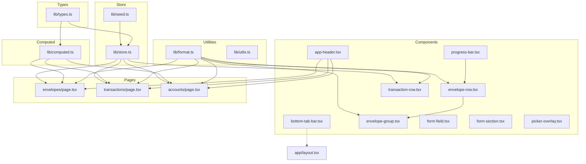
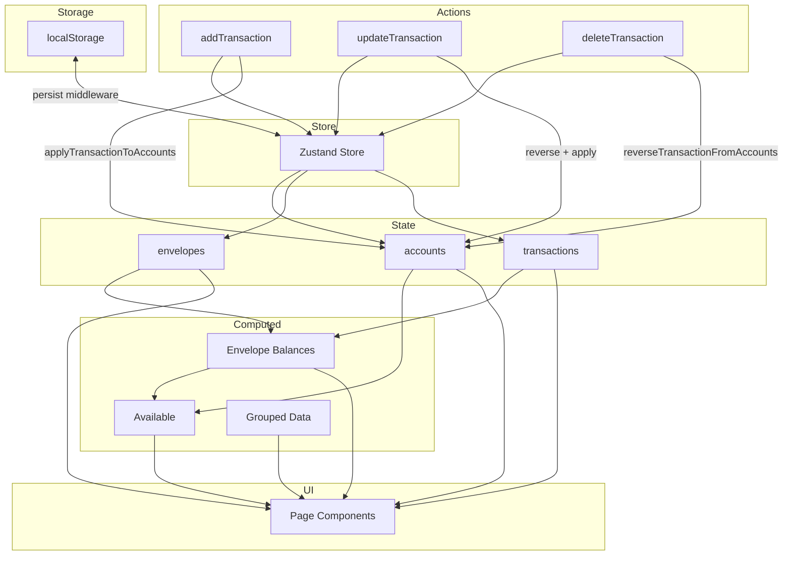

# Envelope Budget App — Full Architectural & Semantic Mapping

**Generated:** 2026-02-22  
**Purpose:** Context foundation for all future refactoring and development

---

## 1. HIGH-LEVEL ARCHITECTURE

### System Type
**Mobile-First Web Application (SPA)** — A client-side only Next.js application using the App Router, designed for LAN hosting and mobile browser access. No backend API; all data persists in browser localStorage.

### Architectural Style
**Layered Component Architecture with Global State Management**

```
┌─────────────────────────────────────────────────────────────┐
│                    PRESENTATION LAYER                        │
│  Pages (app/) → Components (components/) → UI Primitives     │
├─────────────────────────────────────────────────────────────┤
│                    STATE MANAGEMENT                          │
│  Zustand Store (lib/store.ts) + Computed Values (computed.ts)│
├─────────────────────────────────────────────────────────────┤
│                    DATA PERSISTENCE                          │
│  localStorage via Zustand persist middleware                 │
└─────────────────────────────────────────────────────────────┘
```

### Major Subsystems

| Subsystem | Responsibility | Entry Point |
|-----------|---------------|-------------|
| **Envelopes** | Budget envelope management, balance tracking | `/envelopes` |
| **Transactions** | Transaction CRUD, scheduling, type-specific flows | `/transactions` |
| **Accounts** | Account management, on-budget/debt tracking | `/accounts` |
| **Reports** | Placeholder (stub) | `/reports` |
| **More/Settings** | Household settings, data management | `/more` |

### Runtime Flow: Start → Request → Response

```
1. Application Bootstrap
   ├── Next.js renders Root Layout (app/layout.tsx)
   ├── Root Page redirects to /envelopes (app/page.tsx)
   └── App Shell Layout loads (app/(app)/layout.tsx)
       ├── Hydration check via useStoreHydration()
       ├── Shows spinner until localStorage hydrated
       └── Renders children + BottomTabBar

2. Page Request (e.g., /envelopes)
   ├── Server Component renders page shell
   ├── Client Component hydrates
   ├── Component subscribes to Zustand store slices
   └── Computed values derived on each render

3. User Interaction (e.g., Add Transaction)
   ├── Form state managed in component useState
   ├── On Save: calls store action (addTransaction)
   ├── Store updates state + persists to localStorage
   ├── Account balances updated atomically
   └── React re-renders affected components
```

---

## 2. DIRECTORY & MODULE MAP

### `/app` — Next.js App Router Pages

| Path | Responsibility | Depends On | Depended By | Classification |
|------|---------------|------------|-------------|----------------|
| `layout.tsx` | Root HTML shell, metadata | None | All pages | Core |
| `page.tsx` | Root redirect to /envelopes | Next router | None | Core |
| `globals.css` | Global styles, CSS variables | None | All | Config |
| `(app)/layout.tsx` | App shell with hydration guard | `useStoreHydration`, `BottomTabBar` | All app pages | Core |
| `(app)/envelopes/page.tsx` | Envelope list view | Store, computed, components | None | Feature |
| `(app)/envelopes/[id]/page.tsx` | Envelope detail view | Store, computed, components | None | Feature |
| `(app)/envelopes/[id]/edit/page.tsx` | Edit envelope form | Store, types, format | None | Feature |
| `(app)/envelopes/add/page.tsx` | Add envelope form | Store, types, format | None | Feature |
| `(app)/envelopes/edit-budget/page.tsx` | Bulk budget editor | Store, computed | None | Feature |
| `(app)/accounts/page.tsx` | Account list view | Store, computed, components | None | Feature |
| `(app)/accounts/[id]/page.tsx` | Account detail view | Store, computed | None | Feature |
| `(app)/accounts/[id]/edit/page.tsx` | Edit account form | Store, types | None | Feature |
| `(app)/accounts/add/page.tsx` | Add account form | Store, types | None | Feature |
| `(app)/transactions/page.tsx` | Transaction list with upcoming | Store, computed | None | Feature |
| `(app)/transactions/search/page.tsx` | Search transactions | Store, computed | None | Feature |
| `(app)/transactions/add/page.tsx` | Add transaction form (complex) | Store, types, computed | None | Feature |
| `(app)/transactions/add-income/page.tsx` | 3-step income flow | Store, types, computed | None | Feature |
| `(app)/transactions/[id]/edit/page.tsx` | Edit transaction form | Store, types | None | Feature |
| `(app)/transactions/[id]/edit-income/page.tsx` | Edit income transaction | Store, types | None | Feature |
| `(app)/reports/page.tsx` | Reports stub | None | None | Placeholder |
| `(app)/more/page.tsx` | Settings/household | Store | None | Feature |

### `/lib` — Core Business Logic

| File | Responsibility | Depends On | Depended By | Classification |
|------|---------------|------------|-------------|----------------|
| `types.ts` | All TypeScript types/interfaces | None | All files | Core |
| `store.ts` | Zustand store, actions, persistence | types, seed | All pages | Core |
| `computed.ts` | Derived state calculations | types | Pages, components | Core |
| `format.ts` | Currency/date formatting (ZAR locale) | date-fns | Pages, components | Utility |
| `utils.ts` | Tailwind class merging utility | clsx, tailwind-merge | UI components | Utility |
| `seed.ts` | Initial/demo data | types | store.ts | Config |
| `use-store-hydration.ts` | SSR hydration guard | React | App shell | Utility |

### `/components` — Custom Components

| File | Responsibility | Depends On | Depended By | Classification |
|------|---------------|------------|-------------|----------------|
| `app-header.tsx` | Green header with left/center/right slots | None | All pages | Core |
| `bottom-tab-bar.tsx` | 5-tab navigation | Next router | App shell | Core |
| `envelope-group.tsx` | Grouped envelope display | `envelope-row`, format | Envelopes page | Feature |
| `envelope-row.tsx` | Single envelope row with progress | `progress-bar`, format | `envelope-group` | Feature |
| `transaction-row.tsx` | Transaction display row | Store, format | Transaction lists | Feature |
| `progress-bar.tsx` | Visual balance indicator | None | Envelope rows | UI |
| `date-group-header.tsx` | Date section header | format | Transaction lists | UI |
| `form-field.tsx` | Reusable form row | lucide-react | All forms | Core |
| `form-section.tsx` | Form field grouping | None | All forms | UI |
| `picker-overlay.tsx` | Full-screen picker modal | lucide-react | All pickers | Core |
| `empty-hint.tsx` | Empty state hint | lucide-react | Lists | UI |
| `theme-provider.tsx` | next-themes wrapper | next-themes | (unused) | Legacy |

### `/components/ui` — shadcn/ui Components

All 50+ components are **external library integrations** from shadcn/ui. They are:
- Radix UI primitives wrapped with Tailwind styling
- Generated via shadcn CLI (see `components.json`)
- **Not custom code** — standard library usage
- Key used components: `button`, `input`, `dialog`, `popover`, `calendar`, `command`

### `/hooks` — Custom Hooks

| File | Responsibility | Used By |
|------|---------------|---------|
| `use-mobile.ts` | Mobile breakpoint detection | UI components |
| `use-toast.ts` | Toast notification system | UI components |

### `/public` — Static Assets

Standard Next.js static assets: icons, placeholders, logos.

---

## 3. DEPENDENCY GRAPH

### Internal Module Dependencies



### External Libraries (from package.json)

| Library | Version | Purpose |
|---------|---------|---------|
| `next` | 16.1.6 | React framework with App Router |
| `react` | 19.2.4 | UI library |
| `react-dom` | 19.2.4 | React DOM renderer |
| `zustand` | 5.0.0 | Global state management with persistence |
| `date-fns` | 4.1.0 | Date formatting/manipulation |
| `lucide-react` | 0.564.0 | Icon library |
| `tailwind-merge` | 3.3.1 | Tailwind class deduplication |
| `clsx` | 2.1.1 | Conditional class names |
| `class-variance-authority` | 0.7.1 | Component variant management |
| `next-themes` | 0.4.6 | Theme switching (unused in always-dark app) |
| `react-hook-form` | 7.54.1 | Form state management (imported but not actively used) |
| `zod` | 3.24.1 | Schema validation (imported but not actively used) |
| `@hookform/resolvers` | 3.9.1 | Form validation resolvers (imported but not actively used) |
| `recharts` | 2.15.0 | Charting library (for future Reports) |
| `sonner` | 1.7.1 | Toast notifications |
| `cmdk` | 1.1.1 | Command palette (shadcn dependency) |
| `vaul` | 1.1.2 | Drawer component (shadcn dependency) |
| `@radix-ui/*` | various | Headless UI primitives for shadcn |
| `@vercel/analytics` | 1.6.1 | Analytics (deployment) |

### Dependency Analysis

**No Circular Dependencies Detected** — The architecture follows a clean unidirectional flow:
```
Types → Store → Pages → Components → UI Primitives
```

**Tight Coupling Areas:**
1. **Transaction forms** are tightly coupled to store actions and type-specific field rendering
2. **Computed values** are recalculated on every render (no memoization)
3. **Format utilities** are used pervasively across all display components

**Hidden Coupling:**
- `useBudgetStore` is accessed directly in 15+ components — any store refactor affects many files
- Transaction type logic is duplicated across add/edit/edit-income pages

---

## 4. DATA & STATE MODEL

### Core Data Models (from `lib/types.ts`)

```
Household
└── name: string

Account
├── id: string
├── name: string
├── type: AccountType (checking | savings | cash | credit_card | debt)
├── balance: number
├── isOnBudget: boolean
├── sortOrder: number
└── [debt fields]: status, linkedEnvelopeId, monthlyPayment, interestRate, dueDay

EnvelopeGroup
├── id: string
├── name: string
└── sortOrder: number

Envelope
├── id: string
├── groupId: string
├── name: string
├── budgetAmount: number
├── frequency: EnvelopeFrequency
├── sortOrder: number
└── dueDay?: number

Transaction
├── id: string
├── type: TransactionType (7 types)
├── date: string (ISO)
├── amount: number
├── note?: string
├── isScheduled: boolean
├── scheduleFrequency?: ScheduleFrequency
├── [expense fields]: payee, envelopeId, accountId, isCredit, checkNum
├── [income fields]: payer, fills[]
├── [transfer fields]: fromEnvelopeId, toEnvelopeId, fromAccountId, toAccountId
└── [debt fields]: debtAccountId

EnvelopeFill
├── envelopeId: string
└── amount: number
```

### State Storage & Mutation

**Global Store (`useBudgetStore`)** — Zustand with persist middleware:

```typescript
// State
household: Household
accounts: Account[]
envelopeGroups: EnvelopeGroup[]
envelopes: Envelope[]
transactions: Transaction[]

// Actions
addAccount, updateAccount, deleteAccount, reorderAccounts
addEnvelopeGroup, updateEnvelopeGroup, deleteEnvelopeGroup
addEnvelope, updateEnvelope, deleteEnvelope, reorderEnvelopes
addTransaction, updateTransaction, deleteTransaction
updateHouseholdName, clearAllData
```

**Persistence:** `localStorage` key: `'envelope-budget-storage'`

**Critical Balance Logic:**
- Account balances are **mutated** when transactions are added/updated/deleted
- [`applyTransactionToAccounts()`](lib/store.ts:60) — adjusts balances based on transaction type
- [`reverseTransactionFromAccounts()`](lib/store.ts:104) — reverses effect for updates/deletes
- Scheduled transactions (`isScheduled: true`) do NOT affect account balances

### Computed Values (from `lib/computed.ts`)

These are **derived on every render**, not stored:

| Function | Calculation |
|----------|-------------|
| `getEnvelopeBalance()` | Sum of fills - expenses for envelope |
| `getAllEnvelopeBalances()` | Map of all envelope balances |
| `getAvailable()` | On-budget accounts total - envelope balances total |
| `getGroupTotal()` | Sum of envelope balances in group |
| `getAllEnvelopesTotal()` | Sum of all envelope balances |
| `getGroupedEnvelopes()` | Envelopes grouped and sorted |
| `getTransactionsGroupedByDate()` | Posted transactions by date |
| `getUpcomingTransactions()` | Scheduled transactions sorted |
| `getOnBudgetAccountTotal()` | Sum of on-budget account balances |
| `getDebtAccountTotal()` | Sum of debt account balances |
| `getTotalBudgeted()` | Sum of budget amounts by frequency |

### Data Flow Diagram



---

## 5. FEATURE MAP

### Feature: Envelope Management

| Aspect | Implementation |
|--------|----------------|
| List view | [`app/(app)/envelopes/page.tsx`](app/(app)/envelopes/page.tsx) |
| Detail view | [`app/(app)/envelopes/[id]/page.tsx`](app/(app)/envelopes/[id]/page.tsx) |
| Add envelope | [`app/(app)/envelopes/add/page.tsx`](app/(app)/envelopes/add/page.tsx) |
| Edit envelope | [`app/(app)/envelopes/[id]/edit/page.tsx`](app/(app)/envelopes/[id]/edit/page.tsx) |
| Bulk edit budgets | [`app/(app)/envelopes/edit-budget/page.tsx`](app/(app)/envelopes/edit-budget/page.tsx) |
| Display components | [`envelope-group.tsx`](components/envelope-group.tsx), [`envelope-row.tsx`](components/envelope-row.tsx), [`progress-bar.tsx`](components/progress-bar.tsx) |
| Store actions | `addEnvelope`, `updateEnvelope`, `deleteEnvelope`, `reorderEnvelopes` |

### Feature: Transaction Management

| Aspect | Implementation |
|--------|----------------|
| List view | [`app/(app)/transactions/page.tsx`](app/(app)/transactions/page.tsx) |
| Search | [`app/(app)/transactions/search/page.tsx`](app/(app)/transactions/search/page.tsx) |
| Add transaction | [`app/(app)/transactions/add/page.tsx`](app/(app)/transactions/add/page.tsx) — 483 lines, handles 7 transaction types |
| Add income (3-step) | [`app/(app)/transactions/add-income/page.tsx`](app/(app)/transactions/add-income/page.tsx) |
| Edit transaction | [`app/(app)/transactions/[id]/edit/page.tsx`](app/(app)/transactions/[id]/edit/page.tsx) |
| Edit income | [`app/(app)/transactions/[id]/edit-income/page.tsx`](app/(app)/transactions/[id]/edit-income/page.tsx) |
| Display component | [`transaction-row.tsx`](components/transaction-row.tsx) |
| Store actions | `addTransaction`, `updateTransaction`, `deleteTransaction` |

### Feature: Account Management

| Aspect | Implementation |
|--------|----------------|
| List view | [`app/(app)/accounts/page.tsx`](app/(app)/accounts/page.tsx) |
| Detail view | [`app/(app)/accounts/[id]/page.tsx`](app/(app)/accounts/[id]/page.tsx) |
| Add account | [`app/(app)/accounts/add/page.tsx`](app/(app)/accounts/add/page.tsx) |
| Edit account | [`app/(app)/accounts/[id]/edit/page.tsx`](app/(app)/accounts/[id]/edit/page.tsx) |
| Store actions | `addAccount`, `updateAccount`, `deleteAccount`, `reorderAccounts` |

### Feature: Reports

| Aspect | Implementation |
|--------|----------------|
| Page | [`app/(app)/reports/page.tsx`](app/(app)/reports/page.tsx) — stub only |

### Feature: Settings/More

| Aspect | Implementation |
|--------|----------------|
| Page | [`app/(app)/more/page.tsx`](app/(app)/more/page.tsx) |
| Store actions | `updateHouseholdName`, `clearAllData` |

### Shared Infrastructure

| Component | Used By |
|-----------|---------|
| [`AppHeader`](components/app-header.tsx) | All pages |
| [`BottomTabBar`](components/bottom-tab-bar.tsx) | App shell |
| [`FormField`](components/form-field.tsx) | All forms |
| [`FormSection`](components/form-section.tsx) | All forms |
| [`PickerOverlay`](components/picker-overlay.tsx) | All pickers |
| [`DateGroupHeader`](components/date-group-header.tsx) | Transaction lists |
| [`EmptyHint`](components/empty-hint.tsx) | Empty lists |

---

## 6. CONTROL FLOW & LIFECYCLES

### Application Startup Sequence

```
1. Next.js initializes App Router
2. Root Layout renders (server component)
   ├── Loads fonts (Geist, Geist Mono)
   ├── Sets metadata
   └── Renders html/body shell
3. Root Page redirects to /envelopes
4. App Shell Layout renders (client component)
   ├── useStoreHydration() returns false initially
   ├── Shows loading spinner
   ├── useEffect runs after mount
   ├── setHydrated(true) called
   ├── Re-render with hydrated=true
   └── Renders children + BottomTabBar
5. Envelopes Page renders
   ├── Subscribes to store slices
   ├── Computes derived values
   └── Renders envelope list
```

### Request/Interaction Lifecycle

```
User taps "Add Transaction"
    ↓
Router navigates to /transactions/add
    ↓
AddTransactionPage renders
    ├── useState for form fields
    ├── Picker overlays for selections
    └── FormField components for inputs
    ↓
User fills form, taps Save
    ↓
handleSave() called
    ├── Validates canSave()
    ├── Calls addTransaction() from store
    │   ├── Generates ID
    │   ├── Applies transaction to accounts
    │   ├── Updates state
    │   └── Persists to localStorage
    └── router.back()
    ↓
Previous page re-renders with new data
```

### Transaction Type Decision Tree

```
Transaction Type Selected
├── expense → Payee, Amount, Envelope, Account
├── add_income → Redirect to /transactions/add-income (3-step flow)
├── fill_from_available → Amount, Envelope (fills directly)
├── envelope_transfer → Amount, From Envelope, To Envelope
├── account_transfer → Amount, From Account, To Account
├── debt_payment → Amount, Account, Debt Account
└── interest_fee_charge → Amount, Debt Account
```

### Background/Scheduled Logic

**None currently implemented.** Scheduled transactions exist in data but:
- No automatic posting when date arrives
- No background jobs or intervals
- Manual posting via tap on "Upcoming" section

---

## 7. CONFIGURATION & ENVIRONMENT

### Environment Variables

**None defined.** The application is fully client-side with no external API calls.

### Config Files

| File | Purpose |
|------|---------|
| `next.config.mjs` | Next.js config: TypeScript errors ignored, images unoptimized |
| `tsconfig.json` | TypeScript: strict mode, path alias `@/*` |
| `tailwind.config` | (via CSS) Tailwind v4 with custom theme tokens |
| `components.json` | shadcn/ui configuration: new-york style, lucide icons |
| `postcss.config.mjs` | PostCSS for Tailwind processing |

### Build System

- **Framework:** Next.js 16.1.6 with App Router
- **Bundler:** Turbopack (Next.js default)
- **CSS:** Tailwind CSS v4 with PostCSS
- **Package Manager:** pnpm (indicated by pnpm-lock.yaml)

### Deployment Assumptions

Per design decisions:
- **Hosting:** LAN-hosted for home users
- **Access:** Mobile browsers (phones/tablets)
- **PWA:** Not implemented (explicitly declined)
- **Data:** Single shared household (all users see same data via same browser/device)

### Critical Config Issues

⚠️ **`next.config.mjs` has `typescript.ignoreBuildErrors: true`**

This means TypeScript errors do NOT block production builds. This is a risk — type errors may slip into production.

---

## 8. RISK & COMPLEXITY AREAS

### God Files (Too Many Responsibilities)

| File | Lines | Issues |
|------|-------|--------|
| [`transactions/add/page.tsx`](app/(app)/transactions/add/page.tsx) | 483 | Handles 7 transaction types, multiple pickers, complex validation |
| [`transactions/[id]/edit/page.tsx`](app/(app)/transactions/[id]/edit/page.tsx) | 280 | Duplicates add page logic with edit-specific concerns |
| [`transactions/add-income/page.tsx`](app/(app)/transactions/add-income/page.tsx) | 271 | 3-step wizard with fill logic |
| [`store.ts`](lib/store.ts) | 306 | All state + balance mutation logic |

### Overloaded Modules

**Transaction Forms** — The add/edit transaction pages contain:
- Form state management (10+ useState calls)
- Type-specific field rendering
- Picker management
- Validation logic
- Navigation logic
- Payee autocomplete

**Recommendation:** Extract into:
- `useTransactionForm` hook
- Type-specific field components
- Shared validation utilities

### Implicit Behavior

1. **Account Balance Updates** — Hidden inside `addTransaction`/`updateTransaction`/`deleteTransaction`. Not obvious that calling these mutates account balances.

2. **Envelope Balance Calculation** — Always computed from all transactions. No caching. Could be slow with many transactions.

3. **Hydration Pattern** — The `useStoreHydration` hook is critical for SSR but only used in one place. Easy to forget.

4. **Type Routing** — "Add Income" type redirects to a completely different page (`/transactions/add-income`). Not obvious from the picker.

### Hard-to-Trace Logic

1. **Transaction Type → Fields Mapping** — Scattered across multiple forms with switch statements. No single source of truth.

2. **Fill Logic** — Income fills are stored as `fills[]` array on transaction, but envelope balances are computed by scanning ALL transactions.

3. **Scheduled vs Posted** — `isScheduled` flag determines if transaction affects balances, but this is only documented in code comments.

### Areas Likely to Break During Refactor

1. **Balance Calculations** — Any change to transaction structure requires updating:
   - `applyTransactionToAccounts()`
   - `reverseTransactionFromAccounts()`
   - `getEnvelopeBalance()`
   - All computed functions

2. **Form State** — Adding new transaction types or fields requires touching multiple large files.

3. **Picker Components** — Pickers are tightly coupled to parent forms via callbacks and state setters.

4. **Type Definitions** — Adding fields to types requires updating all forms that use those types.

---

## 9. WHAT IS NOT WORKING / NEEDS FIXING

### Critical Issues

1. **TypeScript Build Errors Ignored** — `next.config.mjs` has `ignoreBuildErrors: true`. This masks potential type errors.

2. **No Form Validation Library** — Despite `react-hook-form` and `zod` being installed, forms use manual `useState` with no validation beyond `canSave()` checks.

3. **Date Input via Prompt** — Date selection uses `prompt('Enter date (YYYY-MM-DD):')` instead of a proper date picker. This is a poor UX.

### Missing Features (Per Design Doc)

1. **Reports Tab** — Stub only, shows "coming soon"

2. **Scheduled Transaction Auto-Posting** — Scheduled transactions exist but must be manually posted

3. **Split Transactions** — Deferred to v2 per design decisions

4. **Drag-to-Reorder** — UI shows drag handles but no drag implementation

5. **Due Date Logic** — `dueDay` field exists on envelopes but is not used

### Technical Debt

1. **Unused Dependencies** — `react-hook-form`, `zod`, `@hookform/resolvers` are installed but not used

2. **Unused Theme Provider** — `theme-provider.tsx` exists but app is always-dark, no theme switching

3. **Duplicate Code** — Add/Edit transaction forms share ~80% code but are separate files

4. **No Error Boundaries** — No error handling UI for runtime errors

5. **No Loading States** — Only the hydration spinner exists; no per-page loading states

6. **No Memoization** — Computed values recalculate on every render

### UX Issues

1. **Confirm Dialogs** — Uses native `confirm()` for delete actions

2. **No Undo** — Deleting transactions/accounts has no undo mechanism

3. **No Offline Indicator** — No feedback if localStorage fails

---

## 10. MENTAL MODEL SUMMARY

### How This System Really Works

**Envelope Budget** is a client-side-only budgeting app where:

1. **All data lives in localStorage** — No backend, no sync, no multi-device support

2. **Envelopes are virtual containers** — They don't store money; they track allocated funds via transaction history

3. **Account balances are canonical** — Real money lives in accounts; envelope balances are computed

4. **"Available" is the key metric** — `Available = On-budget accounts - Envelope balances` — this is money not yet allocated

5. **Transactions are the source of truth** — Every money movement creates a transaction record

6. **Balance updates are atomic** — When a transaction is saved, account balances update immediately

7. **The app is a single-page app** — Next.js App Router provides routing, but all rendering is client-side

8. **Hydration matters** — The app shows a spinner until Zustand rehydrates from localStorage

### The 10 Most Important Files

1. **[`lib/store.ts`](lib/store.ts)** — All state management and balance mutation logic
2. **[`lib/types.ts`](lib/types.ts)** — All TypeScript definitions
3. **[`lib/computed.ts`](lib/computed.ts)** — All derived state calculations
4. **[`app/(app)/transactions/add/page.tsx`](app/(app)/transactions/add/page.tsx)** — Main transaction entry point
5. **[`app/(app)/transactions/add-income/page.tsx`](app/(app)/transactions/add-income/page.tsx)** — Income/fill flow
6. **[`app/(app)/envelopes/page.tsx`](app/(app)/envelopes/page.tsx)** — Main envelope view (home screen)
7. **[`lib/format.ts`](lib/format.ts)** — Currency/date formatting (ZAR locale)
8. **[`components/picker-overlay.tsx`](components/picker-overlay.tsx)** — Core selection UI pattern
9. **[`app/(app)/layout.tsx`](app/(app)/layout.tsx)** — App shell with hydration guard
10. **[`app/globals.css`](app/globals.css)** — Theme tokens and styling

### The 10 Most Important Concepts

1. **Envelope Budgeting** — Money is allocated to envelopes; spending reduces envelope balance, not account balance directly

2. **On-Budget vs Off-Budget** — Only on-budget accounts contribute to "Available"; debt accounts are tracked separately

3. **Transaction Types** — 7 different types with different field requirements and balance effects

4. **Computed Balances** — Envelope balances are never stored; always computed from transaction history

5. **Available Calculation** — The key equation: `On-budget accounts total - Envelope balances total`

6. **Hydration Guard** — Client-side store must rehydrate from localStorage before rendering

7. **Picker Pattern** — Full-screen selection overlays instead of dropdowns

8. **3-Step Income Flow** — Income entry → Destination selection → Envelope fills

9. **Scheduled Transactions** — Future transactions that don't affect balances until posted

10. **ZAR Locale** — South African Rand formatting with space thousands separator and comma decimal

---

## APPENDIX: File Statistics

| Category | Count | Total Lines |
|----------|-------|-------------|
| Pages | 17 | ~2,500 |
| Custom Components | 12 | ~600 |
| UI Components (shadcn) | 50+ | ~5,000 |
| Lib Files | 7 | ~700 |
| Hooks | 2 | ~210 |
| Config Files | 5 | ~150 |

**Total Project Size:** ~8,500 lines of code (excluding UI library)

---

*End of Architectural Mapping Document*
