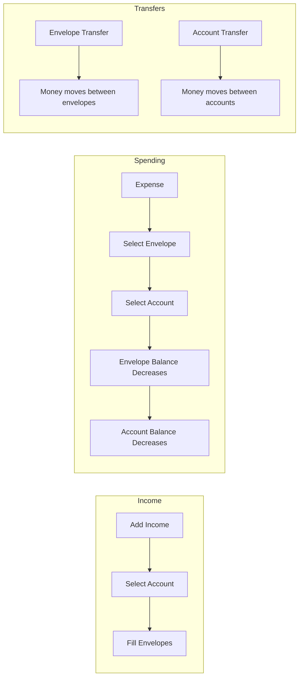

# Envelope Budget App — Mental Model Documentation

**Purpose:** A developer's guide to understanding this codebase deeply enough to make changes without introducing subtle bugs.

**Generated:** 2026-02-22

---

## 1. Core Mental Models

### The Envelope Budgeting Paradigm

This app implements the **envelope budgeting method** (also known as "zero-based budgeting"). Understanding this is foundational:

```
┌─────────────────────────────────────────────────────────────────┐
│                     THE CORE EQUATION                           │
│                                                                 │
│   Available = On-Budget Accounts Total - Envelope Balances      │
│                                                                 │
│   "Available" = Money that exists but isn't assigned anywhere   │
└─────────────────────────────────────────────────────────────────┘
```

**Key Insight:** Envelopes don't "contain" money. They represent **allocations**. The money never leaves your bank account; the envelope just tracks what portion of that money is earmarked for a specific purpose.

### The Three Pillars

```
┌──────────────────┐     ┌──────────────────┐     ┌──────────────────┐
│     ACCOUNTS     │     │    ENVELOPES     │     │  TRANSACTIONS    │
│                  │     │                  │     │                  │
│ • Real money     │     │ • Virtual        │     │ • Source of      │
│ • Balance stored │     │   allocations    │     │   truth for      │
│   in state       │     │ • Balance        │     │   envelope       │
│ • Mutated by     │     │   COMPUTED       │     │   balances       │
│   transactions   │     │   from txns      │     │                  │
└──────────────────┘     └──────────────────┘     └──────────────────┘
         │                        │                        │
         │                        │                        │
         ▼                        ▼                        ▼
   Stored in State         Computed on Render        Stored in State
   (canonical)             (derived)                 (canonical)
```

### How Money Flows



### The Transaction Type Taxonomy

There are **7 transaction types**, each with different effects:

| Type | Account Effect | Envelope Effect | Use Case |
|------|---------------|-----------------|----------|
| `expense` | Decreases | Decreases specific envelope | Spending money |
| `add_income` | Increases | Increases via fills | Receiving money |
| `fill_from_available` | None | Increases envelope | Allocating unassigned money |
| `envelope_transfer` | None | Moves between envelopes | Reallocating budget |
| `account_transfer` | Moves between accounts | None | Moving real money |
| `debt_payment` | Decreases source, increases debt | None | Paying off debt |
| `interest_fee_charge` | Decreases debt | None | Adding to debt balance |

---

## 2. Critical "Never Forget" Rules

### Rule 1: Envelope Balances Are NEVER Stored

```typescript
// ❌ WRONG - Envelope balances are not stored
const envelope = envelopes.find(e => e.id === '123')
console.log(envelope.balance) // This field doesn't exist!

// ✅ CORRECT - Always compute from transactions
const balance = getEnvelopeBalance(envelopeId, transactions)
```

**Why:** This is a deliberate design choice. By computing balances from transaction history, the system maintains an audit trail and can never get out of sync.

**Implication:** If you add a new transaction type, you MUST update [`getEnvelopeBalance()`](lib/computed.ts:7).

---

### Rule 2: Account Balances ARE Stored and Mutated

```typescript
// In store.ts - addTransaction DOES mutate account balances
addTransaction: (transaction) => {
  set((state) => ({
    transactions: [...state.transactions, fullTx],
    accounts: applyTransactionToAccounts(state.accounts, fullTx), // ← MUTATION!
  }))
}
```

**Why:** Account balances represent real money in real accounts. They must be stored because they can be affected by external factors (bank fees, interest, etc.) that the app doesn't track.

**Implication:** Never manually update `account.balance` directly. Always go through transaction actions.

---

### Rule 3: Scheduled Transactions Don't Affect Balances

```typescript
// In applyTransactionToAccounts()
if (tx.isScheduled) return accounts // ← Early return, no balance change
```

**Why:** A scheduled transaction is a "future intent." It shouldn't affect current balances until it's "posted" (converted to a regular transaction).

**Implication:** When implementing scheduled transaction posting, you must:
1. Set `isScheduled: false`
2. The store will automatically apply the balance effect

---

### Rule 4: Hydration Must Complete Before Rendering

```typescript
// In app/(app)/layout.tsx
const hydrated = useStoreHydration()

if (!hydrated) {
  return <LoadingSpinner /> // ← NEVER skip this check
}
```

**Why:** Zustand's persist middleware loads from localStorage asynchronously. If you render before hydration, you'll get:
- Hydration mismatch errors
- Empty/seed data flashing on screen
- Potential data corruption

**Implication:** Any new page that accesses the store must be wrapped by the app shell, or implement its own hydration guard.

---

### Rule 5: The Income Flow Is Special

```typescript
// In transactions/add/page.tsx
if (txType === 'add_income') {
  router.replace('/transactions/add-income') // ← Redirects to different page!
  return
}
```

**Why:** Income requires a 3-step wizard:
1. Enter income amount and payer
2. Select destination account
3. Distribute to envelopes (fills)

This is too complex for the generic add transaction form.

**Implication:** Never try to handle income in the regular add transaction form. The redirect is intentional.

---

### Rule 6: On-Budget vs Off-Budget Matters

```typescript
// In getAvailable()
const accountTotal = accounts
  .filter((a) => a.isOnBudget) // ← Only on-budget accounts!
  .reduce((sum, a) => sum + a.balance, 0)
```

**Why:** Off-budget accounts (like tracking accounts or debt) shouldn't contribute to "Available" because that money isn't available for budgeting.

**Implication:** When creating accounts, `isOnBudget` must be set correctly. Changing this flag later will cause "Available" to jump unexpectedly.

---

### Rule 7: Credit Expenses Are Refunds

```typescript
// In getEnvelopeBalance()
if (tx.type === 'expense' && tx.envelopeId === envelopeId) {
  if (tx.isCredit) {
    balance += tx.amount // Credit = refund, adds back
  } else {
    balance -= tx.amount
  }
}
```

**Why:** A credit (refund) to an envelope should increase its balance, not decrease it.

**Implication:** The `isCredit` flag only applies to expenses. Don't try to use it for other transaction types.

---

## 3. Common Misconceptions

### Misconception 1: "I can just update an envelope's balance directly"

**Reality:** Envelopes don't have a `balance` field. The balance is computed from all transactions that reference that envelope.

**What trips people up:** The envelope type definition has `budgetAmount`, which looks like it could be a balance. But `budgetAmount` is the target allocation, not the current balance.

---

### Misconception 2: "Deleting a transaction just removes it from the list"

**Reality:** Deleting a transaction also reverses its effect on account balances:

```typescript
deleteTransaction: (id) => {
  set((state) => {
    const tx = state.transactions.find((t) => t.id === id)
    return {
      transactions: state.transactions.filter((t) => t.id !== id),
      accounts: reverseTransactionFromAccounts(state.accounts, tx), // ← Balance fix!
    }
  })
}
```

**What trips people up:** If you manually remove a transaction from the array without using `deleteTransaction()`, account balances will be wrong.

---

### Misconception 3: "Account transfers affect envelopes"

**Reality:** Account transfers only move money between accounts. They have no effect on envelope balances.

**What trips people up:** It seems like moving money from checking to savings should affect your budget. But in envelope budgeting, the envelope allocation is independent of which account holds the money.

---

### Misconception 4: "I can add a new transaction type by just adding to the union"

**Reality:** Adding a transaction type requires updates in multiple places:

1. [`lib/types.ts`](lib/types.ts:44) - Add to `TransactionType` union
2. [`lib/types.ts`](lib/types.ts:104) - Add to `TRANSACTION_TYPE_LABELS`
3. [`lib/store.ts`](lib/store.ts:60) - Add to `applyTransactionToAccounts()`
4. [`lib/store.ts`](lib/store.ts:104) - Add to `reverseTransactionFromAccounts()`
5. [`lib/computed.ts`](lib/computed.ts:7) - Add to `getEnvelopeBalance()` if envelope-affecting
6. [`app/(app)/transactions/add/page.tsx`](app/(app)/transactions/add/page.tsx) - Add form fields
7. [`app/(app)/transactions/[id]/edit/page.tsx`](app/(app)/transactions/[id]/edit/page.tsx) - Add edit fields
8. [`components/transaction-row.tsx`](components/transaction-row.tsx) - Add display logic

**What trips people up:** Forgetting one of these locations causes silent bugs where transactions don't affect balances correctly.

---

### Misconception 5: "The store is just a state container"

**Reality:** The store contains critical business logic for balance mutations. It's not just storing data; it's enforcing invariants.

**What trips people up:** Trying to bypass the store actions and directly mutate state, which breaks the balance synchronization.

---

### Misconception 6: "ZAR formatting is just for display"

**Reality:** The ZAR formatting functions are used for both display AND parsing user input:

```typescript
// User enters "4 085,50" (South African format)
const amount = parseZARInput(amountStr) // Returns 4085.5
```

**What trips people up:** Using `parseFloat()` directly on user input will fail because of the space thousands separator and comma decimal.

---

## 4. The "Gotchas" List

### Gotcha 1: The Date Input Is a Browser Prompt

```typescript
// In transactions/add/page.tsx line 278
onTap={() => {
  const input = prompt('Enter date (YYYY-MM-DD):', dateStr)
  if (input) setDateStr(input)
}}
```

**Why it's weird:** This is a native browser prompt, not a custom date picker. It's a known UX issue.

**What to watch for:** If you're testing and the date input seems broken, check if browser prompts are blocked.

---

### Gotcha 2: TypeScript Errors Don't Block Builds

```javascript
// In next.config.mjs
export default {
  typescript: {
    ignoreBuildErrors: true, // ← DANGER!
  },
}
```

**Why it's dangerous:** Type errors can slip into production. Always run `pnpm tsc --noEmit` locally before considering a change complete.

---

### Gotcha 3: Fills Are Nested in Transactions

```typescript
// Transaction structure for income
{
  type: 'add_income',
  amount: 5000,
  fills: [
    { envelopeId: 'groceries', amount: 2000 },
    { envelopeId: 'rent', amount: 3000 }
  ]
}
```

**Why it's tricky:** The `fills` array is how income distributes to envelopes. The `amount` is the total income, but `fills` may not sum to `amount` (user can leave money unallocated).

---

### Gotcha 4: Envelope Groups Cascade on Delete

```typescript
deleteEnvelopeGroup: (id) => {
  set((state) => ({
    envelopeGroups: state.envelopeGroups.filter((g) => g.id !== id),
    envelopes: state.envelopes.filter((e) => e.groupId !== id), // ← Envelopes deleted too!
  }))
}
```

**Why it's tricky:** Deleting a group deletes all its envelopes. This doesn't affect transactions (they still reference the envelope ID), but those envelopes will no longer appear in the UI.

---

### Gotcha 5: The `description` Field Is Auto-Generated

```typescript
// In add transaction
description:
  txType === 'envelope_transfer'
    ? `${fromEnvelope?.name || ''} -> ${toEnvelope?.name || ''}`
    : txType === 'account_transfer'
      ? `${fromAccount?.name || ''} -> ${toAccount?.name || ''}`
      : undefined,
```

**Why it's tricky:** The `description` field is only set for transfers and is auto-generated from the entity names. It's not user-editable.

---

### Gotcha 6: Computed Values Recalculate Every Render

```typescript
// In a page component
const envelopeBalances = getAllEnvelopeBalances(envelopes, transactions)
```

**Why it's a problem:** With many transactions, this could become slow. There's no memoization.

**What to watch for:** If you're adding computed values, consider the performance impact. The current implementation is O(n) for each envelope balance calculation.

---

### Gotcha 7: The Seed Data Is Always Present Initially

```typescript
// In store.ts
household: seedHousehold,
accounts: seedAccounts,
envelopeGroups: seedEnvelopeGroups,
envelopes: seedEnvelopes,
transactions: seedTransactions,
```

**Why it's tricky:** New users will see demo data. The `clearAllData()` action exists to reset, but there's no "first run" detection.

**What to watch for:** If testing with fresh localStorage, you'll see seed data, not empty state.

---

### Gotcha 8: Debt Accounts Are Also in the Accounts Array

```typescript
// Debt accounts are just accounts with type: 'debt'
{
  id: 'debt-1',
  name: 'Credit Card',
  type: 'debt',
  balance: -5000, // Negative = owed amount
  isOnBudget: false,
  // Debt-specific fields
  status: 'working_to_pay_off',
  linkedEnvelopeId: 'envelope-1',
  monthlyPayment: 200,
  interestRate: 18.5,
  dueDay: 15,
}
```

**Why it's tricky:** Debt accounts are in the same array as checking/savings accounts but have different behavior and additional fields.

---

## 5. Change Impact Map

### If You Change Transaction Structure...

**Files that MUST be updated:**

| File | What to Update |
|------|----------------|
| [`lib/types.ts`](lib/types.ts:58) | Transaction interface |
| [`lib/store.ts`](lib/store.ts:60) | `applyTransactionToAccounts()` |
| [`lib/store.ts`](lib/store.ts:104) | `reverseTransactionFromAccounts()` |
| [`lib/computed.ts`](lib/computed.ts:7) | `getEnvelopeBalance()` |
| [`app/(app)/transactions/add/page.tsx`](app/(app)/transactions/add/page.tsx) | Form fields and save logic |
| [`app/(app)/transactions/[id]/edit/page.tsx`](app/(app)/transactions/[id]/edit/page.tsx) | Edit form fields |
| [`components/transaction-row.tsx`](components/transaction-row.tsx) | Display logic |

**Testing checklist:**
- [ ] Create new transaction with new field
- [ ] Edit existing transaction with new field
- [ ] Delete transaction with new field
- [ ] Verify account balances correct after each operation
- [ ] Verify envelope balances correct after each operation

---

### If You Change Envelope Structure...

**Files that MUST be updated:**

| File | What to Update |
|------|----------------|
| [`lib/types.ts`](lib/types.ts:34) | Envelope interface |
| [`lib/store.ts`](lib/store.ts:210) | Envelope actions |
| [`lib/computed.ts`](lib/computed.ts:44) | `getAllEnvelopeBalances()` if needed |
| [`app/(app)/envelopes/add/page.tsx`](app/(app)/envelopes/add/page.tsx) | Add form |
| [`app/(app)/envelopes/[id]/edit/page.tsx`](app/(app)/envelopes/[id]/edit/page.tsx) | Edit form |
| [`app/(app)/envelopes/page.tsx`](app/(app)/envelopes/page.tsx) | List display |
| [`components/envelope-row.tsx`](components/envelope-row.tsx) | Row display |

**Testing checklist:**
- [ ] Create envelope with new field
- [ ] Edit envelope with new field
- [ ] Delete envelope (verify transactions still reference old ID)
- [ ] Verify envelope balance calculation still works

---

### If You Change Account Structure...

**Files that MUST be updated:**

| File | What to Update |
|------|----------------|
| [`lib/types.ts`](lib/types.ts:5) | Account interface |
| [`lib/store.ts`](lib/store.ts:154) | Account actions |
| [`lib/computed.ts`](lib/computed.ts:59) | `getAvailable()`, `getOnBudgetAccountTotal()` |
| [`app/(app)/accounts/add/page.tsx`](app/(app)/accounts/add/page.tsx) | Add form |
| [`app/(app)/accounts/[id]/edit/page.tsx`](app/(app)/accounts/[id]/edit/page.tsx) | Edit form |
| [`app/(app)/accounts/page.tsx`](app/(app)/accounts/page.tsx) | List display |

**Testing checklist:**
- [ ] Create account with new field
- [ ] Edit account with new field
- [ ] Delete account (verify transactions still reference old ID)
- [ ] Verify "Available" calculation still correct
- [ ] Verify on-budget vs off-budget behavior

---

### If You Change Balance Calculation Logic...

**This is the highest-risk change.**

**Files that MUST be updated:**

| File | What to Update |
|------|----------------|
| [`lib/computed.ts`](lib/computed.ts:7) | `getEnvelopeBalance()` |
| [`lib/computed.ts`](lib/computed.ts:59) | `getAvailable()` |
| [`lib/store.ts`](lib/store.ts:60) | `applyTransactionToAccounts()` |
| [`lib/store.ts`](lib/store.ts:104) | `reverseTransactionFromAccounts()` |

**Critical testing:**
1. Create transaction → verify both account and envelope balances
2. Edit transaction → verify old effect reversed, new effect applied
3. Delete transaction → verify effect reversed
4. Test all 7 transaction types
5. Test with scheduled transactions
6. Test with credits/refunds
7. Verify "Available" matches: On-budget accounts - Envelope totals

---

### Tightly Coupled File Groups

```
┌─────────────────────────────────────────────────────────────────┐
│                    TRANSACTION FORM CLUSTER                      │
│                                                                  │
│  transactions/add/page.tsx  ←──→  transactions/[id]/edit/page.tsx│
│              ↑                              ↑                    │
│              └──────────────────────────────┘                    │
│                    (80% code duplication)                        │
└─────────────────────────────────────────────────────────────────┘

┌─────────────────────────────────────────────────────────────────┐
│                    BALANCE CALCULATION CLUSTER                   │
│                                                                  │
│  store.ts (apply/reverse)  ←──→  computed.ts (getEnvelopeBalance)│
│              ↑                              ↑                    │
│              └──────────────────────────────┘                    │
│          (must stay in sync for correct balances)                │
└─────────────────────────────────────────────────────────────────┘

┌─────────────────────────────────────────────────────────────────┐
│                    ENVELOPE DISPLAY CLUSTER                      │
│                                                                  │
│  envelopes/page.tsx  →  envelope-group.tsx  →  envelope-row.tsx │
│                                    ↓                             │
│                              progress-bar.tsx                    │
└─────────────────────────────────────────────────────────────────┘
```

---

## 6. Quick Reference Decision Tree

### "I need to add a new transaction type"

```
1. lib/types.ts
   └── Add to TransactionType union
   └── Add to TRANSACTION_TYPE_LABELS

2. lib/store.ts
   └── Add case to applyTransactionToAccounts()
   └── Add case to reverseTransactionFromAccounts()

3. lib/computed.ts
   └── Add case to getEnvelopeBalance() (if envelope-affecting)

4. app/(app)/transactions/add/page.tsx
   └── Add form fields for new type
   └── Add to canSave() validation
   └── Add to handleSave() transaction creation

5. app/(app)/transactions/[id]/edit/page.tsx
   └── Add form fields for new type
   └── Add to edit logic

6. components/transaction-row.tsx
   └── Add display case for new type

7. TEST ALL THE THINGS
   └── Create, edit, delete
   └── Verify account balances
   └── Verify envelope balances
```

---

### "I need to add a new field to envelopes"

```
1. lib/types.ts
   └── Add field to Envelope interface

2. app/(app)/envelopes/add/page.tsx
   └── Add form field
   └── Add to addEnvelope() call

3. app/(app)/envelopes/[id]/edit/page.tsx
   └── Add form field
   └── Add to updateEnvelope() call

4. app/(app)/envelopes/page.tsx
   └── Display new field if needed

5. components/envelope-row.tsx
   └── Display new field in row

6. lib/computed.ts
   └── Update if field affects calculations

7. CONSIDER MIGRATION
   └── Existing envelopes won't have new field
   └── Add default value handling
```

---

### "I need to change how balances are calculated"

```
⚠️ HIGH RISK CHANGE ⚠️

1. Document the change thoroughly
   └── What was the old behavior?
   └── What is the new behavior?
   └── Why is the change needed?

2. Update lib/computed.ts
   └── getEnvelopeBalance() - core calculation
   └── getAvailable() - if account relationship changes
   └── Any other affected functions

3. Update lib/store.ts
   └── applyTransactionToAccounts() - how accounts change
   └── reverseTransactionFromAccounts() - must be exact inverse

4. CRITICAL: Verify inverse relationship
   └── apply(reverse(apply(tx))) === apply(tx)
   └── Test with all 7 transaction types

5. Test with real data
   └── Create sample transactions
   └── Verify balances match expected
   └── Edit transactions
   └── Delete transactions

6. Consider data migration
   └── Existing transactions may need adjustment
   └── Account balances may need recalculation
```

---

### "I need to add a new page that uses store data"

```
1. Ensure page is within app/(app)/ layout
   └── The app shell provides hydration guard
   └── If outside, implement your own useStoreHydration()

2. Import and use the store
   └── import { useBudgetStore } from '@/lib/store'
   └── const data = useBudgetStore((s) => s.someSlice)

3. For computed values
   └── import { getEnvelopeBalance, etc } from '@/lib/computed'
   └── Pass store slices to computed functions

4. For mutations
   └── const addThing = useBudgetStore((s) => s.addThing)
   └── Call addThing() in event handlers

5. Test hydration
   └── Refresh the page
   └── Verify no flash of empty/seed data
   └── Verify data loads correctly
```

---

### "I need to add a new account type"

```
1. lib/types.ts
   └── Add to AccountType union
   └── Add to ACCOUNT_TYPE_LABELS

2. lib/computed.ts
   └── Update getOnBudgetAccountTotal() if needed
   └── Update getDebtAccountTotal() if needed
   └── Update getAvailable() if on-budget logic changes

3. app/(app)/accounts/add/page.tsx
   └── Add type to picker
   └── Add type-specific fields if needed

4. app/(app)/accounts/[id]/edit/page.tsx
   └── Add type to picker
   └── Add type-specific fields if needed

5. app/(app)/accounts/page.tsx
   └── Update display logic if needed

6. lib/store.ts
   └── Update applyTransactionToAccounts() if account type affects transactions
   └── Update reverseTransactionFromAccounts() to match

7. CONSIDER IMPLICATIONS
   └── Should this account type be on-budget by default?
   └── Does it affect debt calculations?
   └── Are there new transaction types needed?
```

---

## Summary: The 10 Commandments of This Codebase

1. **Thou shalt never store envelope balances** — They are always computed from transactions.

2. **Thou shalt always use store actions for mutations** — Direct state mutation breaks balance synchronization.

3. **Thou shalt honor the hydration guard** — Rendering before hydration causes mismatches.

4. **Thou shalt update both apply and reverse functions** — They must be exact inverses.

5. **Thou shalt remember that scheduled transactions don't affect balances** — Until posted.

6. **Thou shalt use ZAR formatting functions for user input** — Not `parseFloat()`.

7. **Thou shalt redirect income to the special flow** — The 3-step wizard is intentional.

8. **Thou shalt respect on-budget vs off-budget** — It affects "Available" calculations.

9. **Thou shalt test all transaction types after balance changes** — Each type has different effects.

10. **Thou shalt run TypeScript checks despite the config** — `ignoreBuildErrors` is a trap.

---

*End of Mental Model Documentation*
